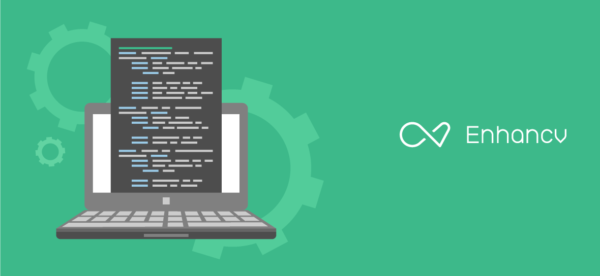

# Developer
Full-time | Product team: 5-10 people | Sofia, Bulgaria

### Enhancv
We're a company building browser based resume editing software - wildly regarded as the best out there, with ambitions on taking on the big boys in hiring and recruiting. More about us, our mission and values at our site: https://enhancv.com/about.html (Open Sourced [here at github](https://github.com/enhancv/homepage))

### Team
A small team of developers, designers and marketing people, spread around offices in Sofia and Dublin, we've established good process for building our product, allowing people to work remote and adopting new technologies and aproaches. We also have occasional [power weeks](https://blog.enhancv.com/?s=power+week) bringing all of us together to work and play for a week.

### Technology
We're doing this with `nodejs`, `webpack`, `es6`, `react`, `redux` and `python`, on `heroku` and `AWS`. We're using [github flow](https://guides.github.com/introduction/flow/) for our developing process with mutual code reviews and a good amount of integration & unit tests.
We also have some of our code open sourced at https://github.com/enhancv. as we believe that coding in the open produces code that is well documented, tested, refined and lasting. For an in-depth technologies overview see [TECHNOLOGIES.md](TECHNOLOGIES.md).

### What we need
We need people with attention to detail and drive to excellence, with several projects worth of experience. We like to invest in proper solutions and aggressively refactor problematic areas but sometimes you should be able to get your hands dirty - [real artists ship](https://www.quora.com/What-did-Steve-Jobs-mean-by-real-artists-ship). Specific languages and frameworks knowledge is not that important for us as we know that good developers can pick up new tools with ease, but obviously web tech experience is a plus. You'll be working with both client and server tech but if you like to concentrate on one of those you could do that as well.

## How to apply
Send us a line at work@enhancv.com with your resume / project examples / open source code and we can take it from there. We're [hiring without whiteboards](https://github.com/poteto/hiring-without-whiteboards).
